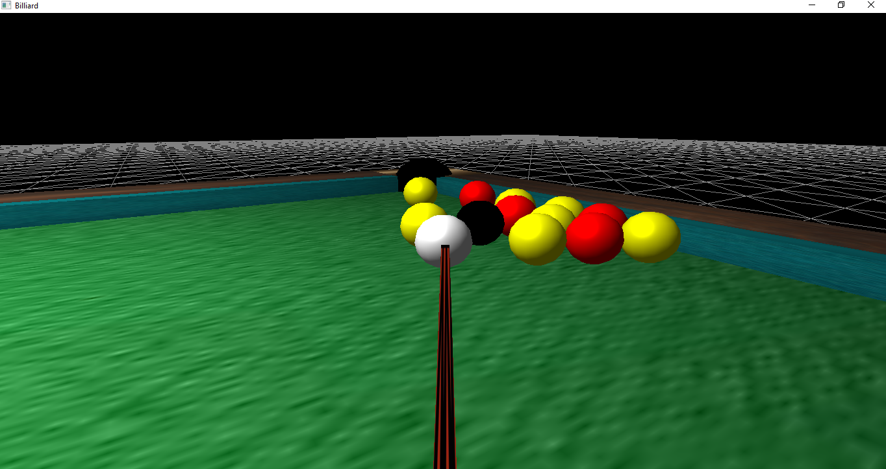
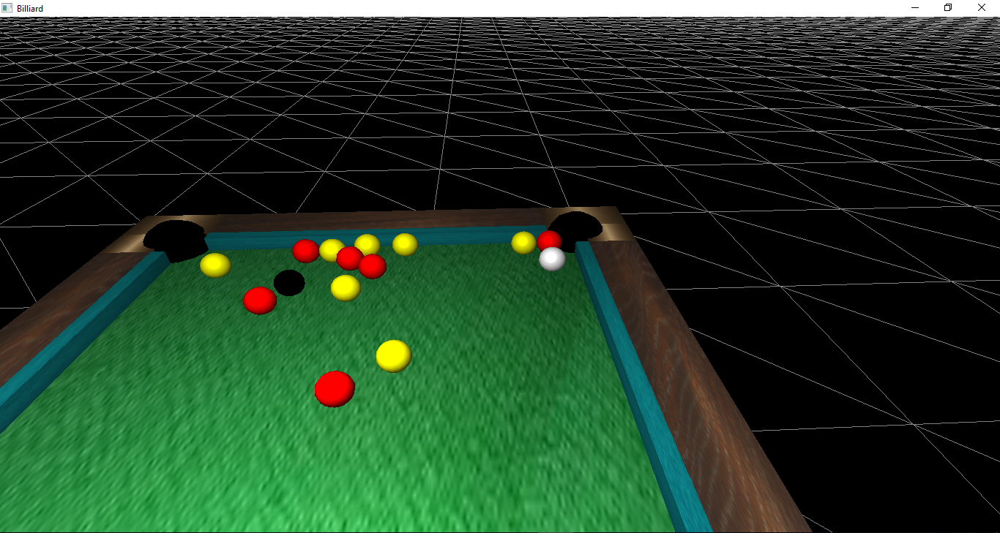

 ____          ___    ___                           __         __    ____      
/\  _`\    __ /\_ \  /\_ \    __                   /\ \      /'__`\ /\  _`\    
\ \ \L\ \ /\_\\//\ \ \//\ \  /\_\     __     _ __  \_\ \    /\_\L\ \\ \ \/\ \  
 \ \  _ <'\/\ \ \ \ \  \ \ \ \/\ \  /'__`\  /\`'__\/'_` \   \/_/_\_<_\ \ \ \ \ 
  \ \ \L\ \\ \ \ \_\ \_ \_\ \_\ \ \/\ \L\.\_\ \ \//\ \L\ \    /\ \L\ \\ \ \_\ \
   \ \____/ \ \_\/\____\/\____\\ \_\ \__/.\_\\ \_\\ \___,_\   \ \____/ \ \____/
    \/___/   \/_/\/____/\/____/ \/_/\/__/\/_/ \/_/ \/__,_ /    \/___/   \/___/ 
                                                                               
 
## EGC---Billiard-3D
	
	Implementarea jocului de Biliard.

